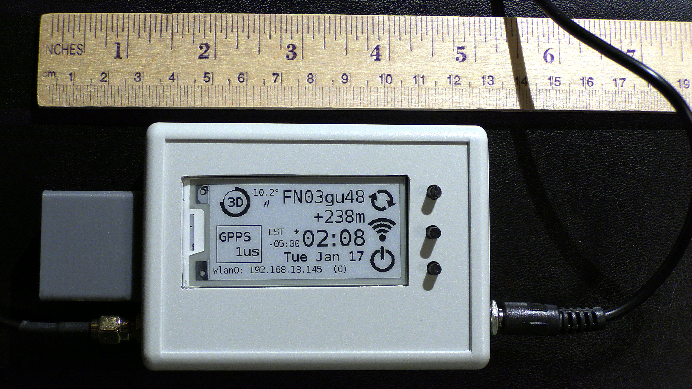
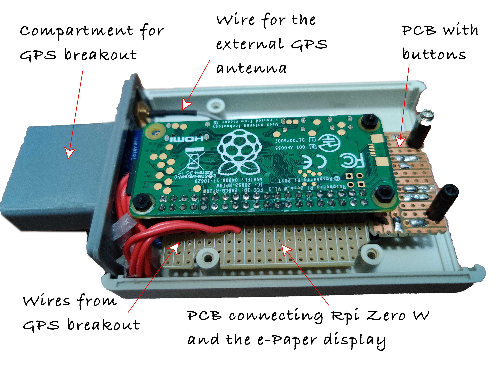
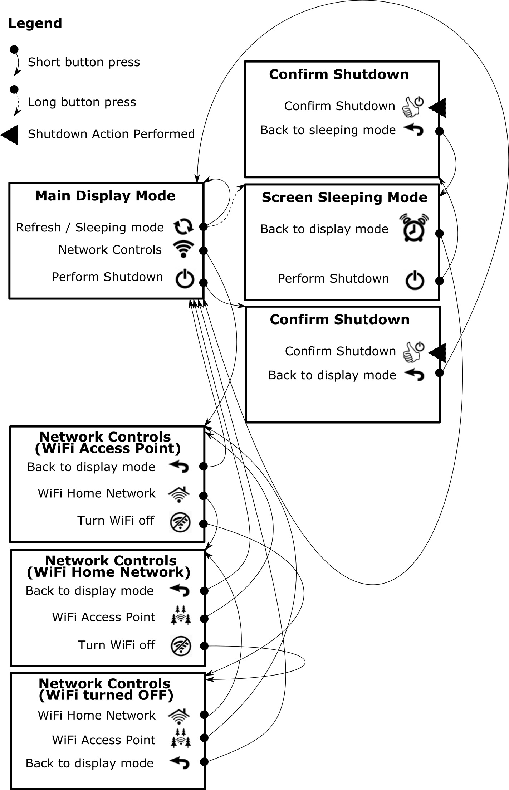

# Portable NTP Server
## Overview
A portable NTP server could be useful in situations where the Internet is not available. For example, operating an Amateur Radio in the field using digital modes that require precise time synchronization (FT8/FT4, etc).

Here is how the device looks like:


It is based on the Raspberry Pi Zero W board and in addition to working as NTP server also provides some various information on the screen including:

* Number of GPS satellites available
* Current location in the Maidenhead Grid form
* Altitude
* Current time and date
* NTP Server precision
* Magnetic declination calculated for the location
* Time Zone determined for the location
* Current TCP/IP address of the device

The device can run on your own local network or can be switched to access point mode (no external network is needed in this case).
It is capable of receiving GPS signals on its internal antenna, but has an SMA connector for the external antenna (it also supports power over coax cable for running the external antenna preamp).
The device can be powered using an USB power connector (your laptop, power bank, etc).

Current consumption depends on the running mode. Because of using eInk type display, it only consumes power during the refresh cycle. It is possible to turn a screen saver on (holding the refresh button for more than a second will display a static picture and will also prevent collection and processing information for display purposes). After devices requiring time synchronization obtained their time information the WiFi can be turned off (at least for a while) to further reduce power consumption. The least power consumption achieved (screen saver is ON, WiFi is OFF, internal antenna used) was measured  at around 110 ma.The maximum measurement (no screen saver, WiFi is ON, external antenna used, screen update is underway) was close to 200 ma.

This document was not meant as a tutorial or a comprehensive manual, but it describes a number of aspects that should help someone who decides to build its own portable NTP server.

## Hardware and Physical Connections

The device consists of the following electronic components:

- Raspberry Pi Zero W board
- WaveShare 2.13inch e-Paper HAT
- GPS Breakout with internal Patch antenna and a socket for external antenna
- 3 push buttons, power socket, SMA connector

Although a display is used in the project, it is not working with Linux OS running on Raspberry Pi. The OS runs in the "headless" mode but a python script was written to display information of the e-Paper screen and control the device.

The eInk display and the RPi Zero W both have a socket-type header. There is a small PCB board with a double-sided plug-type headers. This board is used to connect the display and Rpi Zero W together. The advantage of using the board is that it also accepts wires from GPS breakout as well as from the control buttons.
You can see the internal construction of the device below:



The following RPi pins are used for the buttons:

  - Top: pin 29 (BCM 5)
  - Middle: pin 31 (BCM 6)
  - Bottom: pin 37 (BCM 26) 

GPS breakout is connected by using the following RPi pins:

  - Pwr: pin 1 (3.3V)
  - Ground: pin 6
  - TXD: pin 8
  - RXD: pin 10
  - PPS: pin 16 (BCM 23)

## GPS Breakout Housing   
The device is assembled in a plastic "project box" measuring 3.7 x 2.6 x 1.1 inches. One side of the box is replaced with an extension designed in OpenSCAD and 3D-printed. It is used to house the GPS module. The thin ABS material of the extension does not reduce GPS signal (not by much anyway). It is thin enough to see a monitoring LED on the GPS board  which indicates if the board acquired the lock (LED flashed once in 15 seconds). The OpenSCAD file name for the extension is **enclosure-side.scad** and the corresponding STL file is **enclosure-side.stl**.


## Configuring OS - General
RPi Zero W runs *Raspbian GNU/Linux 10 (Buster)*. The following changes were done to some configuration files.

### /boot/config/txt
Added:
> dtoverlay=pps-gpio,gpiopin=23

### /boot/cmdline.txt
Removed part of the line from the beginning (note a trailing space which also was removed):
> console=serial0,115200␠

## Configuring OS - WiFi Connectivity

The device connectivity has two options: connecting to a local home network or becoming an access point (in which case no existing network is required).
Only one of the two options can be active at any given time. For both of them we
will need to install the *avahi-daemon* and *dhcpcd5* packages. The latter one will need two config files, so make a copy of */etc/dhcpcd.conf* under name */etc/dhcpcd-client.conf*.

In addition to it, for the local home network access we will need to install the *wpasupplicant* package. For the access point mode the following two packages will have to be installed: *hostapd* and *dnsmasq*.   

These packages can be installed using the following command:

```
sudo apt install <package-name>
``` 
After the installation completed, make changes to some configuration files described below.

### /etc/wpa-supplicant/wpa-supplicant.conf

Here you define your local network credentials. Everything is specified according to the following template:

```
network={  
   ssid="your-network-SSID"  
   psk="your-network-password"  
   scan_ssid=0  
} 
``` 

Note, that if your network does not broadcast its SSID, the scan_ssid value should be changed to 1.

### /etc/hostapd/hostapd.conf

Here is how `hostapd` configuration file looks like (replace `<your-access-point-SSID>` and `<password-to connect-to-the-access-point>` with your own values):

```
interface=wlan0
driver=nl80211
ssid=<your-access-point-SSID>
hw_mode=g
channel=7
wmm_enabled=0
macaddr_acl=0
auth_algs=1
ignore_broadcast_ssid=0
wpa=2
wpa_passphrase=<password-to connect-to-the-access-point>
wpa_key_mgmt=WPA-PSK
wpa_pairwise=TKIP
rsn_pairwise=CCMP
```

### /etc/dhcpcd.conf
Only the following statements are uncommented in this configuration file (the IP address of 192.168.19.201 is a static IP address for the device when it is working in the Access Point mode, you can change it to another address, if you wish):

```
# Inform the DHCP server of our hostname for DDNS.
hostname

# Use the hardware address of the interface for the Client ID.
clientid

# Persist interface configuration when dhcpcd exits.
persistent

# Rapid commit support.
option rapid_commit

# A list of options to request from the DHCP server.
option domain_name_servers, domain_name, domain_search, host_name
option classless_static_routes
# Respect the network MTU. This is applied to DHCP routes.
option interface_mtu

# A ServerID is required by RFC2131.
require dhcp_raspberry_pi

# OR generate Stable Private IPv6 Addresses based from the DUID
slaac private

# Example static IP configuration:
interface wlan0
static ip_address=192.168.19.201/24
nohook wpa_supplicant

option ntp-servers 192.168.19.201;
``` 

### /etc/dhcpcd-client.conf
This configuration file is used in the home network mode and has the following uncommented statements:

```
# Inform the DHCP server of our hostname for DDNS.
hostname

# Use the hardware address of the interface for the Client ID.
clientid

# Persist interface configuration when dhcpcd exits.
persistent

# Rapid commit support.
option rapid_commit

# A list of options to request from the DHCP server.
option domain_name_servers, domain_name, domain_search, host_name
option classless_static_routes
# Respect the network MTU. This is applied to DHCP routes.
option interface_mtu

# A ServerID is required by RFC2131.
require dhcp_raspberry_pi

# OR generate Stable Private IPv6 Addresses based from the DUID
slaac private

noipv6

noipv6rs
```

### /etc/dnsmasq.conf
The only uncommented statement in this configuration file defines what IP addresses will be assigned to clients connected to this device when it run in the Access Point mode:

```
# If you want dnsmasq to listen for DHCP and DNS requests only on
# specified interfaces (and the loopback) give the name of the
# interface (eg eth0) here.
# Repeat the line for more than one interface.
interface=wlan0
dhcp-range=192.168.19.202,192.168.19.209,255.255.255.0,24h
```
Note, that the network part of the IP addresses 192.168.19 is the same as in the Access Point address defined in */etc/dhcpcd.conf*.

## Configuring OS - NTP Server
To implement an NTP server which obtains its time from the GPS signals we need to install the following two packages: *gpsd* and *chrony*. After installing them make the following changes to the configuration files listed below:

### /etc/default/gpsd
Change *USBAUTO*:
> USBAUTO="false"

Change *DEVICES*:
> DEVICES="/dev/ttyAMA0 /dev/pps0"

Change *GPSD_OPTIONS*:
> GPSD_OPTIONS="-n"

### /lib/systemd/system/hciuart.service

Changed *After*:
> After=dev-ttyS0.device

In addition to minimum configuration the following packages were installed and configured.
### New package `chrony` and /etc/chrony/chrony.conf 

Install package *chrony* to be used as NTP server. The configuration file looks like this:

>\# Welcome to the chrony configuration file. See chrony.conf(5) for more  
>\# information about usuable directives.
>refclock SHM 0 offset 0.500 delay 0 refid GPS noselect  
>refclock PPS /dev/pps0 lock GPS refid GPPS
>
>pool 2.debian.pool.ntp.org iburst noselect
>
>\# This directive specify the location of the file containing ID/key pairs for  
>\# NTP authentication.  
>keyfile /etc/chrony/chrony.keys
>
>\# This directive specify the file into which chronyd will store the rate   
>\# information.  
>driftfile /var/lib/chrony/chrony.drift
>
>\# Uncomment the following line to turn logging on.  
>\#log tracking measurements statistics  
>
>\# Log files location.  
>logdir /var/log/chrony  
>
>\# Stop bad estimates upsetting machine clock.  
>maxupdateskew 100.0  
>
>\# This directive enables kernel synchronisation (every 11 minutes) of the  
>\# real-time clock. Note that it can’t be used along with the 'rtcfile' directive. 
>rtcsync
>
>\# Step the system clock instead of slewing it if the adjustment is larger than  
>\# one second, but only in the first three clock updates.  
>makestep 1 5
>
>\# Allow local networks  
>allow 192.168.2.0/24  
>allow 192.168.19.0/24  

Note the two local networks defined at the end of the file. The first one is your home local network (replace `192.168.2.0` with the your own network IP address) and the second one is the access point network (it should match the network portion of IP in /etc/dhcpcd.conf and /etc/dnsmasq.conf).

## Configuring OS - Start Monitoring
Monitoring and displaying data on the screen are performed by a Python script `monitor3.py`. There is also a `gpsinit.py` script that needs to be run before it to make sure that the interface to `gpsd` shared memory is activated. It is sort of a "trick" that helped me make initialization of this interface stable. I used `cron` to run both scripts in a single command. `gpsinit.py` starts and ends but `monitor3.py` remains running until you decide to shut down the device.
To insert a new `cron` command for user *root* I used `crontab`:

>sudo su root  
>crontab -e

The first of these commands will switch you to user *root* and the second one will open an editor for `cron' configuration file. In my case it is `nano` which I like better than `vi` (sorry if I disappointed the hard-core linux fans). Insert the following line at the end of the opened configuration file:

```
@reboot sleep 45 && su -l pi -c /home/pi/gpsinit.py && su -l pi -c /home/pi/monitor3.py >>monitor.log 2>&1 1>/home/pi/monitor-log.txt &
```

Save the changes and exit the editor (Control-O and Control-X in `nano`). Now every time the device boots the two scripts will be run after a 45 seconds delay.

## Monitoring Software

Monitoring and displaying data on the screen are performed by a Python script `monitor3.py`. The script requires Python v3 to run as well as some additional python packages: 

`gpsdshm` - provides access to gpsd data by using shared memory

`timezonefinder` and `pytz` - used to a determine time zone for the current location and to work with it 

`pyIGRF` - calculate magnetic declination for the current location and time

`threading` - support for asynchronous programming

`subprocess` - run a shell command to take some action

`PIL` - image manipulation package

`epd2in13` - working with the eInk display

`traceback` - helpful for debugging 

In addition to the main script (`monitor3.py`) the following scripts are used:

`gpsinit.py` - using this tiny script was a trick to make an interface to the `gpsd` server working properly. The script runs once before `monitor3.py` is called.

`set_wifi.sh` - this bash shell script is used to switch between WiFi modes as well as to turn WiFi ON and OFF. It can be run with the following parameters:

- `set_wifi.sh AP` turns WiFi ON in the Access Point mode
- `set_wifi.sh CLIENT` turns WiFi ON in the home network mode
- `set_wifi.sh OFF` turns the WiFi OFF

You don't need to run this script manually. It gets called by `monitor3.py` when needed (see the "Start Monitoring" section).

The user interface is menu-driven. It allows you to switch between the main display mode and the sleep mode when the screen is not updated. The NTP functionality does not stop in the sleep mode, sleeping only refers to the screen behaviour. You can also switch between different WiFi modes (including turning the WiFi off). The full menu flow is shown on the following diagram:


